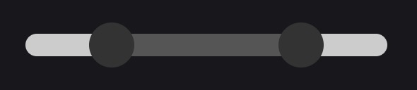

# React Range Slider



A minimal range slider component for React, compatible with NextJS.

## Installation

Install using your favorite package manager:
```bash
npm install react-range-slider
```

Add CSS import to your file or project root (nextjs):
```tsx
import 'react-range-slider/dist/main.css';
```

Import inside component JSX/TSX:

```tsx
import { ReactRangeSlider } from 'react-range-slider';

...

const [low, setLow] = useState(-1000);
const [high, setHigh] = useState(1000);

...

<ReactRangeSlider
    min={-1000}
    max={1000}
    step={100}
    options={{
      leftInputProps: {
        value: low,
        onChange: (e) => setLow(Number(e.target.value)),
      },
      rightInputProps: {
        value: high,
        onChange: (e) => setHigh(Number(e.target.value)),
      },
    }}
/>
...
```

## Prop Types

```typescript
type ReactRangeSliderProps = React.DetailedHTMLProps<React.HTMLAttributes<HTMLDivElement>, HTMLDivElement> & {
  min: number;
  max: number;
  step?: number;
  options?: ReactRangeSliderOptions;
};

type ReactRangeSliderOptions = {
  theme?: Themes;
  thumb?: ThumbProps;
  track?: TrackProps;
  range?: RangeProps;
  leftInputProps?: ReactInputProps;
  rightInputProps?: ReactInputProps;
};

type ReactInputProps = React.DetailedHTMLProps<React.InputHTMLAttributes<HTMLInputElement>, HTMLInputElement>;

type RangeProps = {
  background?: string;
  border?: string;
};

type ThumbProps = {
  background?: string;
  focusBackground?: string;
  width?: string;
  height?: string;
  /** defauts to translateY(-25%) in preset theme */
  transform?: string;
  borderRadius?: string;
  border?: string;
};

type TrackProps = {
  background?: string;
  width?: string;
  height?: string;
  transform?: string;
  borderRadius?: string;
  border?: string;
  margin?: string;
  padding?: string;
};
```

## Extending Functionality

The component is isolated to the component file `src/components/ReactRangeSlider.tsx` and it's CSS file `main.css`. You can clone and add your own default theme, as well as extend by adding more themes and tweaking css files.